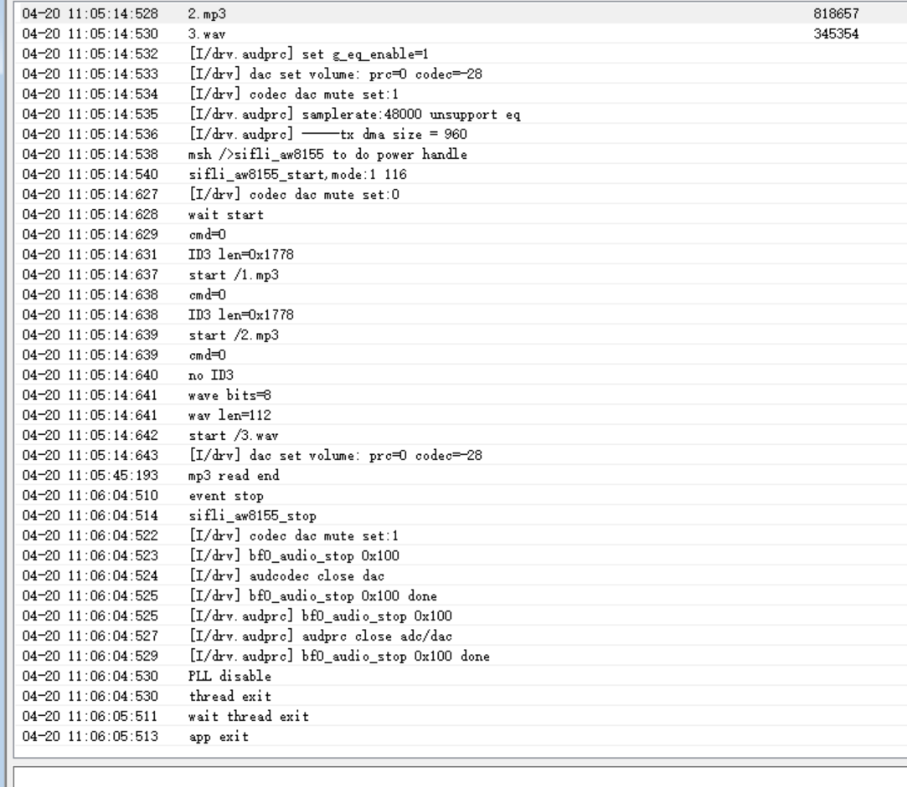

# 音频三路混音播放器

源码路径：example/multimedia/audio/mixer

## 支持的平台
当前在以下平台测试验证通过
+ sf32lb52-lcd_n16r8
+ sf32lb56-lcd_n16r12n1

## 概述
<!-- 例程简介 -->
本例程演示将 3 路本地音频文件同时解码并混音输出。程序启动后会自动挂载文件系统，随后打开根目录下的 3 个音频文件并进行混音播放：
+ /1.mp3
+ /2.mp3
+ /3.wav

混音链路为：
1. 每路独立解码（MP3 使用 libhelix，WAV 支持 PCM/float，PCM 支持 8bit/16bit）。
2. 若采样率不是 48kHz，则先重采样到 48kHz。
3. 3 路单声道 PCM 按样本求和后取均值输出。

## 例程的使用

### 硬件需求
运行该例程前，需要准备：
+ 一块本例程支持的开发板（见支持的平台）。
+ 喇叭

### menuconfig 配置
本例程依赖以下能力，请确认开启：
1. 文件系统：RT_USING_DFS、RT_USING_DFS_ELMFAT。
2. 音频框架：AUDIO、AUDIO_LOCAL_MUSIC。
3. MP3 解码库：PKG_USING_LIBHELIX。

说明：示例工程默认配置中已包含上述关键开关（见 project/proj.conf ）。

### 音频文件准备
例程工程的 disk 目录默认包含 3 个样例文件：
+ 1.mp3
+ 2.mp3
+ 3.wav

说明：为适配固定分区大小，/3.wav 可使用压缩参数（如 11.025kHz、8bit PCM）。当前支持 8bit PCM 与非 48kHz WAV 输入。

构建时会将 disk 打包为文件系统镜像并下载到设备。运行时程序会在根目录查找 /1.mp3、/2.mp3、/3.wav。若你的文件名不同，请将文件名调整为上述名称，或修改源码中的 mix_main 添加文件路径。

### 编译和烧录
切换到例程 project 目录，执行编译：

```bash
scons --board=sf32lb56-lcd_n16r12n1 -j8
```

编译完成后，执行下载脚本：

```bash
 build_sf32lb56-lcd_n16r12n1_hcpu\uart_download.bat
```

## 例程的预期结果
上电后串口会打印类似日志：

```text
mount fs on flash to root success
mix 3 example
Directory /:
1.mp3                                                                              
2.mp3                                                                              
3.wav                                                                             
```
随后可听到三路音频叠加后的混音输出。例程默认运行约 50 秒后停止并退出混音线程。
对应日志如图：


## 异常诊断
1. 没有声音输出：
   - 检查 AUDIO/AUDIO_LOCAL_MUSIC 与板级音频驱动配置是否开启。
   - 检查喇叭或耳机硬件连接。
2. 提示 open 文件失败：
   - 检查文件系统是否成功挂载。
   - 检查镜像中是否包含目标音频文件，以及文件名是否与源码一致。


## 参考文档
+ RT-Thread DFS 文件系统文档：https://www.rt-thread.org/document/site/
+ SiFli SDK 快速上手文档：请参考 SDK 文档中心对应章节。

## 更新记录
|版本 |日期   |发布说明 |
|:---|:---|:---|
|0.0.2 |4/2026 |支持 8bit PCM 与非 48kHz WAV 输入，修正文档中的板卡与编译示例 |
|0.0.1 |4/2026 |初始版本 |
